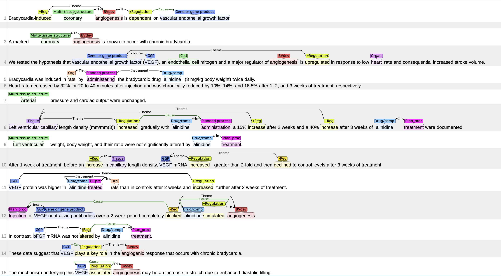

# bio-ee-baseline

here is a repo about biomedical event extraction. 

## biomedical datasets

we evaluate model on [MLEE dataset](http://www.nactem.ac.uk/MLEE/). you can see the annotation visualization in [here](http://www.nactem.ac.uk/eccb2012/index.xhtml#/)

**surprise!** I found a fantastic biomedical github repo [bigscience-workshop/biomedical](https://github.com/bigscience-workshop/biomedical)

> BigBIO (BigScience Biomedical) is an open library of biomedical dataloaders built using Huggingface's (🤗)
